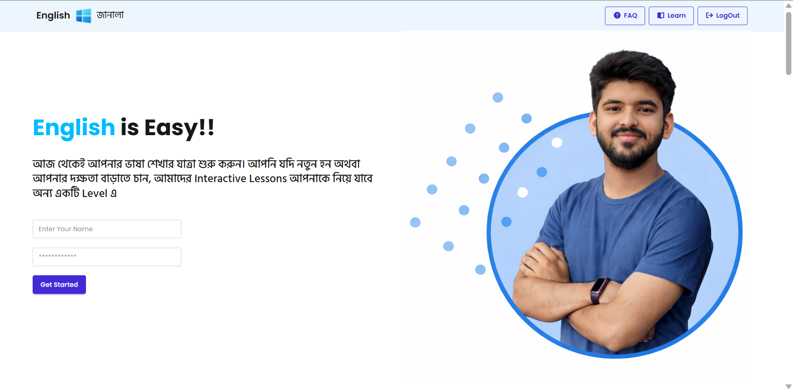
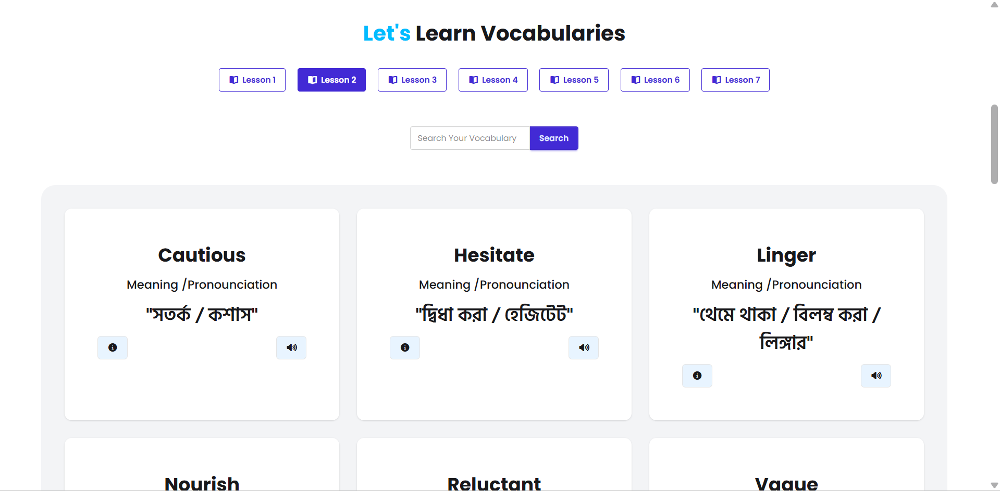
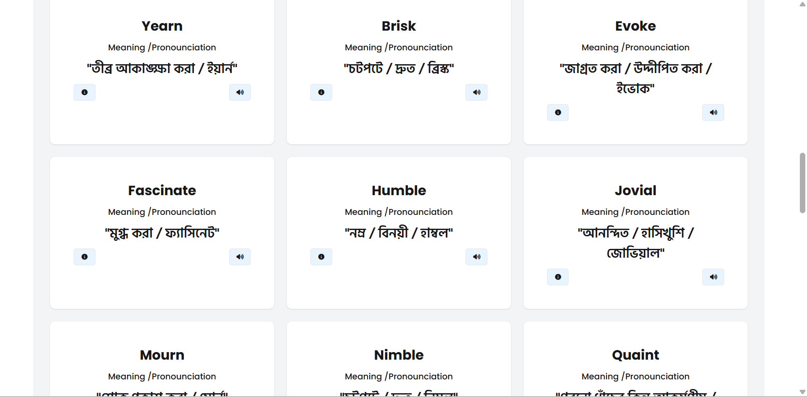
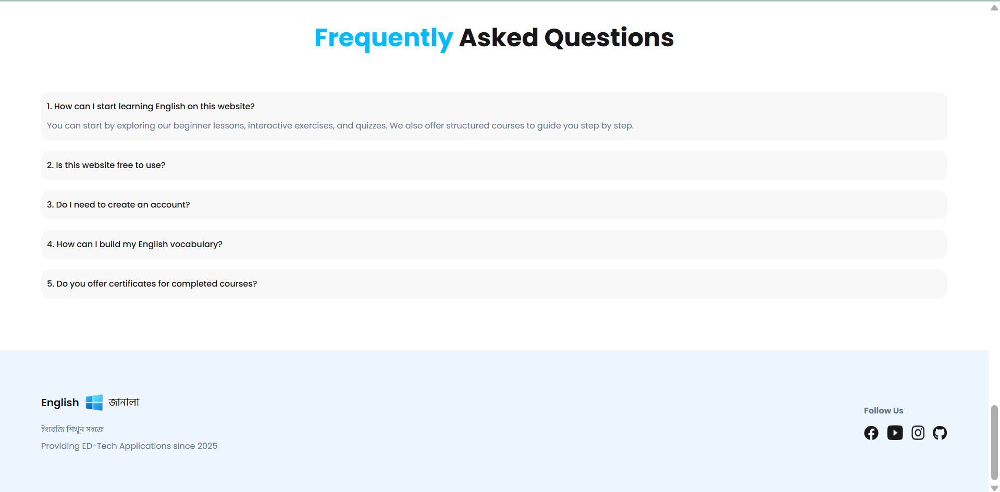

# 📘 English Janala

🚀 A simple and interactive web application to help users learn English easily through structured lessons and a clean user interface.

🔗 **Live Site:** https://atikhasansarker.github.io/English-Janala/

---

## ✨ Features

* 📚 Interactive English learning system
* 🧠 Beginner-friendly lessons
* 🔐 Simple login form (name + password)
* ⚡ Fast and responsive UI
* 🎯 Clean and modern design

---

## 🛠️ Technologies Used

* 🧑‍💻 JavaScript
* 🎨 Tailwind CSS
* 🌼 Daisy UI

---

## 📸 Screenshots

<table>
    <tr>
        <td>
        
        </td>
        <td >
        
        </td>
    </tr>
    <tr>
        <td>
        
        </td>
        <td >
        
        </td>
    </tr>
    
</table>

---

## 🎯 Future Improvements

* 🔊 Add pronunciation/audio support
* 📝 Add quizzes and exercises
* 🌐 Multi-language support
* 📊 User progress tracking

---

## 👨‍💻 Author

**Atik Hasan Sarker**
📍 MERN Stack Developer

---

## ⭐ Support

If you like this project, give it a ⭐ on GitHub!

